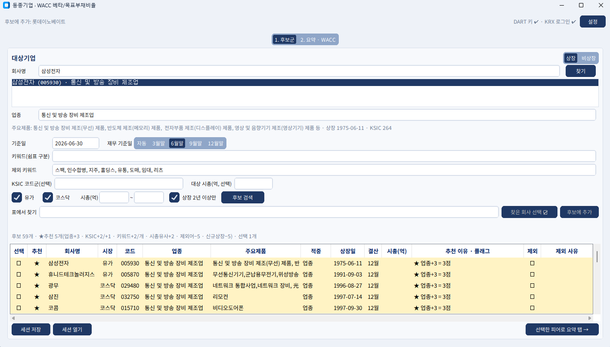
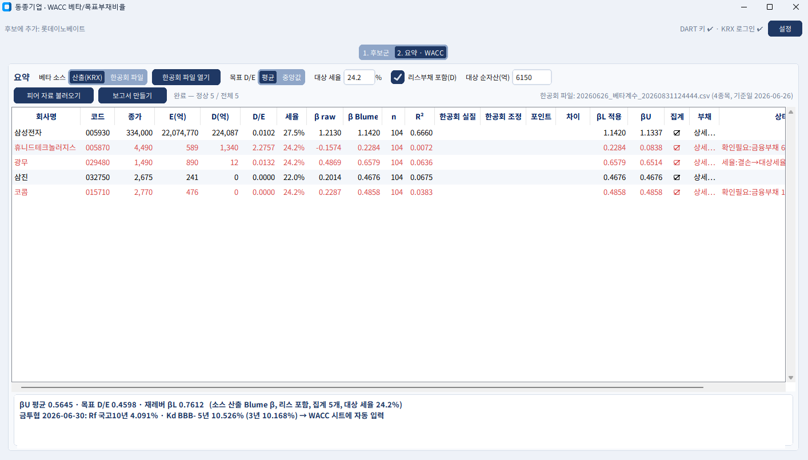
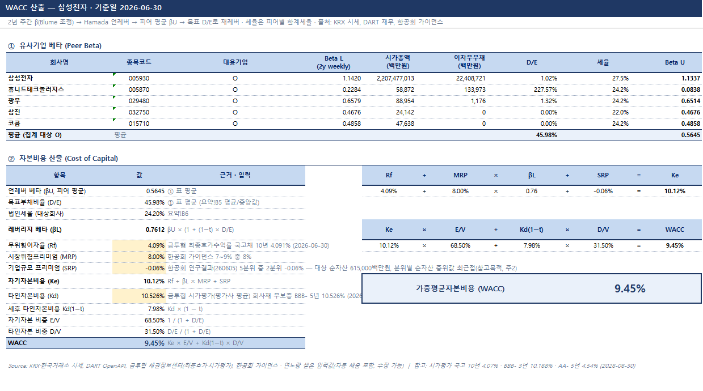

# peer_wacc — 동종기업 후보 스크리닝 · WACC 베타/목표부채비율 산출

KIND 상장사 목록을 키워드로 걸러 유사기업 후보를 고르고, 확정 피어의 KRX 주가·DART 재무·한공회 베타로
βU 평균·목표 D/E·재레버 βL을 계산해 수식이 살아 있는 엑셀 조서를 만든다.

실행: `python app.py` · 테스트: `python -m unittest discover -s tests -t .`
설정: `config.txt` (dart_api_key, krx_id, krx_pw) — git 제외.
피어 선정 기준: `docs/peer_selection_criteria.md`

## 화면

### 1. 후보군 탭 — 피어 후보 스크리닝

대상기업을 찾으면(삼성전자 예시) 업종·KSIC·주요제품이 자동 입력된다. 키워드·제외 키워드·KSIC 코드군·시장·시총
필터로 상장사 전체를 거르고, ★추천 점수(업종 +3 · KSIC +2/+1 · 키워드 +2/개 · 시총유사 +2 · 제외어 −5 ·
신규상장 −5) 순으로 정렬한다. **표에서 찾기**에 회사가 준 피어 리스트를 통째로 붙여넣으면 매칭 행 하이라이트,
일괄 선택, 후보에 없는 종목 추가까지 한 번에 처리한다. **재무 기준일**(자동/3·6·9·12월말)을 지정하면
반기보고서 미공시 기간에도 전 피어의 재무 시점을 통일할 수 있다.

### 2. 요약 탭 — 피어 로드와 β 산출

선택한 피어의 KRX 주가(2년 주간 104주)·DART 재무(이자부부채·유통주식수·한계세율)를 병렬 조회해
피어별 E·D·D/E·세율·β raw·Blume·βU를 표시한다. 베타 소스(산출 KRX vs 한공회 파일) 토글, 집계 열 클릭으로
피어별 포함/제외, '상세…'로 계정별 이자부부채 편집. 결손 세율 대체·금융부채 확인필요 같은 플래그가 빨간색으로
표시된다. 하단에 βU 평균 · 목표 D/E · 재레버 βL 집계와 금투협 Rf·Kd 자동 조회 결과가 뜬다.

### 3. WACC 시트 (엑셀 보고서)

① 유사기업 베타 표(피어 시트 직참조) → ② 자본비용 산출의 한 흐름. Rf(금투협 최종호가 국고채 10년)·
Kd(시가평가 평가사 평균 BBB- 5년)는 '금투협' 원자료 시트를 수식으로 참조하고, SRP는 대상 시총(상장)이나
순자산(비상장)으로 한공회 5분위를 자동 판정한다. 연노랑 셀만 입력값(수정 가능)이고 나머지는 전부 수식이라
입력을 바꾸면 WACC까지 즉시 재계산된다.

## 사용 순서
1. `설정`에서 DART 인증키·KRX 계정 입력(한 번만). KRX 계정이 없으면 베타 소스는 한공회 파일만 가능.
2. 대상기업(상장: 찾기 / 비상장: 업종 선택) → 기준일 → 키워드 → [후보 검색].
3. 후보 표에서 피어 선택☑, 뺄 것은 제외☑ + 사유(감사 추적용, 엑셀 `후보군` 시트에 남음).
4. [피어 자료 불러오기] → KRX 주가·DART 재무 자동 조회 → β·D/E·βU 표시.
5. (선택) [한공회 파일 열기] → 한공회 조정β와 나란히 비교, 소스 토글.
6. [보고서 만들기] → `downloads\WACC피어_{대상}_{기준일}.xlsx`. 요약!B4(소스)·B5(평균/중앙값)만 바꿔도 전체 재계산.

## 산출 규약
2년 주간(104주, 기준일 직전 금요일 마감) KOSPI 회귀 → Blume(2/3·raw+1/3) → Hamada βU=βL/(1+(1−t)·D/E) → 피어 집계 → 목표 D/E로 재레버.
E = 종가×(보통주+우선주 유통주식수)+비지배지분, D = 차입금·사채·리스부채(계정명 기준, 기타금융부채는 플래그).
세율: 피어별 최신 사업보고서 세전이익(과표 대용) → 2026 구간표(11.0/22.0/24.2/27.5%) 한계세율. 결손·미확인은 대상 세율.
Rf·Kd: 금투협 채권정보센터 자동 조회 — Rf = 최종호가수익률 국고채 10년, Kd = 시가평가 기준수익률(평가사 평균) 회사채 무보증 BBB- 5년. 휴일은 직전 영업일. WACC 시트 연노랑 셀에 채워지며 수정 가능.
